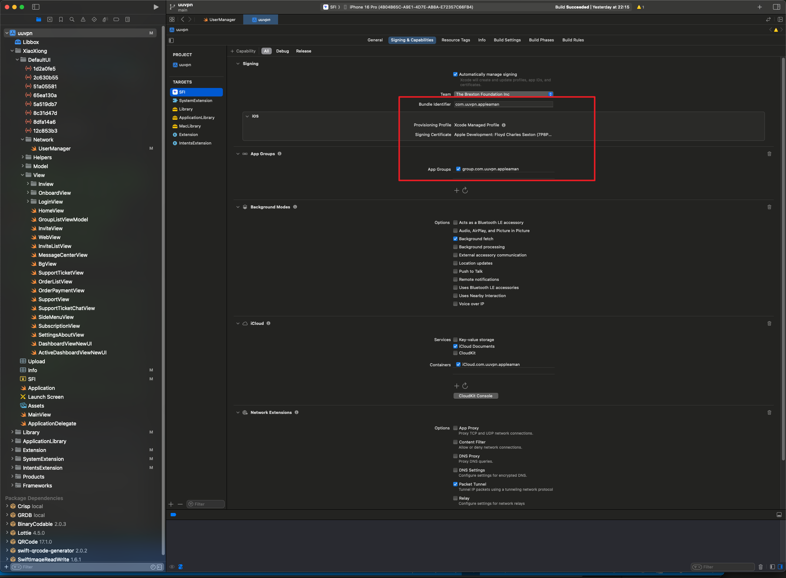

# UUVPN iOS SwiftUI 应用程序

**语言**: [English](README.md) | [中文](README_CN.md)

一个专业的 iOS VPN 应用程序，使用 SwiftUI 构建，专为与 V2Board 面板 API 无缝集成而设计。该应用程序为 VPN 管理提供现代化、直观的界面和全面的配置选项。

## 🚀 功能特性

- **现代化 SwiftUI 界面**：响应式设计，适配不同屏幕尺寸
- **深色/浅色模式支持**：与系统主题自动同步
- **V2Board API 集成**：与 V2Board 面板 API 完整集成
- **网络管理**：使用 `URLSession` 的高级网络功能
- **后台更新**：通过后台任务调度自动更新配置文件
- **多平台支持**：iOS 15.0+ 并兼容 macOS

## 📋 环境要求

在开始之前，请确保您的开发环境满足以下要求：

- **Xcode**：14.0 或更高版本
- **iOS 部署目标**：15.0 或更高版本
- **Swift**：5.7+
- **网络访问**：Swift Package Manager 依赖项需要 VPN 连接

## 🏗️ 项目结构

```
iOS-SwiftUI-Code/
├── ApplicationLibrary/          # 核心应用程序库
│   ├── Service/                 # API 服务和管理器
│   │   ├── StoreManager.swift   # 配置存储管理器
│   │   └── ProfileUpdateTask.swift # 后台更新任务
│   ├── Views/                   # SwiftUI 视图组件
│   │   ├── Dashboard/           # 仪表板界面
│   │   ├── Profile/             # 配置文件管理
│   │   └── Setting/             # 设置界面
│   └── Assets.xcassets/         # 应用程序资源
├── XiaoXiong/                   # 主应用程序目标
│   ├── DefaultUI/               # 默认 UI 组件
│   └── Info.plist               # 应用程序配置
├── Extension/                   # 网络扩展
├── SystemExtension/             # macOS 系统扩展
├── uuvpn.xcodeproj             # Xcode 项目文件
└── README.md                   # 项目文档
```

## ⚙️ 安装与设置

### 1. 克隆仓库

```bash
git clone https://github.com/nicolastinkl/UUVPN/tree/main/iOS-SwiftUI-Code
cd iOS-SwiftUI-Code
```

### 2. 安装依赖

项目使用 Swift Package Manager 进行依赖管理。**注意：需要 VPN 连接才能解析包。**

```bash
# 打开项目时会自动解析依赖项
```

### 3. 在 Xcode 中打开项目

```bash
open uuvpn.xcodeproj
```

选择目标设备或模拟器，然后点击 **运行** 按钮。

## 🔧 V2Board API 配置

### 基础配置

应用程序通过由 [`StoreManager.swift`](ApplicationLibrary/Service/StoreManager.swift:17) 管理的综合 API 配置系统与 V2Board 面板集成。


#### 配置 URL
```swift
public let configURL = "https://api.gooapis.com/api/vpnconfig.php"
```

### API 端点配置

在初始化响应中配置以下 API 端点：

```json
{
  "baseURL": "https://api.0008.uk/api/v1/",
  "baseDYURL": "https://api.gooapis.com/api/vpnnodes.php",
  "mainregisterURL": "https://lelian.app/#/register?code=",
  "paymentURL": "xxxxx",
  "telegramurl": "https://t.me/fastlink",
  "kefuurl": "https://gooapis.com/fastlink/",
  "websiteURL": "https://gooapis.com/fastlink/",
  "crisptoken": "5546c6ea-4b1e-41bc-80e4-4b6648cbca76",
  "banners": [
    "https://image.gooapis.com/api/images/12-11-56.png",
    "https://image.gooapis.com/api/images/12-44-57.png",
    "https://image.gooapis.com/api/images/12-47-03.png"
  ],
  "message": "OK",
  "code": 1
}
```

### API 字段说明

| 字段 | 描述 | 用途 |
|------|------|------|
| `baseURL` | V2Board 面板的主要 API 端点 | 所有主要 API 请求 |
| `baseDYURL` | 默认 VPN 节点测试端点 | 节点连接测试 |
| `mainregisterURL` | 带推荐码的用户注册页面 | 用户引导 |
| `paymentURL` | 支付网关 URL | **App Store 合规性关键** |
| `telegramurl` | Telegram 支持频道 | 客户支持 |
| `kefuurl` | 客服页面 | 在线支持 |
| `websiteURL` | 官方网站 URL | 一般信息 |
| `crisptoken` | Crisp 聊天认证令牌 | 实时聊天集成 |
| `banners` | 推广横幅图片 URL | 营销内容 |
| `message` | 响应状态消息 | API 响应验证 |
| `code` | 响应状态码 | 成功/错误处理 |

### API 请求头

所有 API 请求都包含以下用于身份验证和跟踪的请求头：

```swift
request.addValue("application/json", forHTTPHeaderField: "Content-Type")
request.addValue(Bundle.main.bundleIdentifier ?? "", forHTTPHeaderField: "bid")
request.addValue(UserManager.shared.appversion, forHTTPHeaderField: "appver")
```

## 🆔 Bundle Identifier (BID) 配置

### 理解 Bundle Identifier

Bundle Identifier (BID) 对于应用程序识别和 API 身份验证至关重要。它在整个代码库中被引用为 `Bundle.main.bundleIdentifier`。

### 当前 BID 配置

基于 [`Info.plist`](XiaoXiong/Info.plist:7) 分析，当前 BID 模式为：
```
com.uuvpn.appleaman
```

### 修改 Bundle Identifier

要为您的部署更改 Bundle Identifier：



#### 1. 更新 Xcode 项目设置
1. 在 Xcode 中打开 `uuvpn.xcodeproj`
2. 在导航器中选择项目根目录
3. 选择您的目标（例如 "SFI"、"SFM"、"SFT"）
4. 导航到 **General** → **Identity**
5. 更新 **Bundle Identifier** 字段

#### 2. 更新 Info.plist 引用
在配置文件中搜索并替换所有 BID 引用：

```bash
# 搜索当前 BID 引用
grep -r "com.uuvpn.appleaman" .

# 更新以下文件：
# - XiaoXiong/Info.plist
# - Extension/Info.plist  
# - SystemExtension/Info.plist
# - IntentsExtension/Info.plist
```

#### 3. 更新代码引用
BID 通过以下文件中的 `Bundle.main.bundleIdentifier` 自动获取：
- [`Login.swift`](XiaoXiong/DefaultUI/View/LoginView/Login.swift:494)
- [`HomeView.swift`](XiaoXiong/DefaultUI/View/HomeView.swift:984)

由于使用系统 bundle identifier，无需更改代码。

### API 中的 BID 验证

服务器可以使用 BID 头验证请求，确保 API 调用来自授权应用程序。

## 💳 支付 URL 逻辑与 App Store 合规性

### 支付 URL 长度检测

应用程序基于 `paymentURL` 字段长度实现智能支付处理：

```swift
// Apple 审核模式检测
if (paymentURLKey.count > 3) {
    // 正常支付模式 - 显示外部支付选项
    // 启用订阅功能
    // 显示支付按钮和价格
} else {
    // Apple 审核模式 - 隐藏外部支付
    // 符合 App Store 指南
    // 隐藏敏感支付信息
}
```

### 实现详情

#### 正常模式 (paymentURL.length > 3)
- **外部支付**：引导用户到基于网页的支付系统
- **完整功能访问**：所有订阅功能可用
- **支付集成**：与外部提供商的完整支付流程

#### Apple 审核模式 (paymentURL.length ≤ 3)
- **合规模式**：隐藏外部支付选项
- **功能限制**：审核期间功能受限
- **App Store 指南**：符合 Apple 的支付政策

### 代码实现

该逻辑在多个视图文件中实现：

- [`HomeView.swift`](XiaoXiong/DefaultUI/View/HomeView.swift:125)：主要支付 UI 逻辑
- [`SideMenuView.swift`](XiaoXiong/DefaultUI/View/SideMenuView.swift:119)：菜单支付选项
- [`ActiveDashboardViewNewUI.swift`](XiaoXiong/DefaultUI/View/ActiveDashboardViewNewUI.swift:217)：仪表板支付处理

### 服务器端配置

配置您的初始化端点返回：

```json
{
  "paymentURL": "https://your-payment-gateway.com/pay",  // 正常模式
  // 或者
  "paymentURL": "xx",  // Apple 审核模式
}
```

## 🔄 初始化端点配置

### 端点设置

应用程序在启动时从远程端点获取配置。这允许动态配置而无需应用程序更新。


#### 推荐托管
- **阿里云 OSS**：在中国响应时间更快
- **CDN 集成**：全球内容分发
- **需要 HTTPS**：安全配置传输

### 配置响应格式

```json
{
  "baseURL": "https://your-v2board-panel.com/api/v1/",
  "baseDYURL": "https://your-node-test-endpoint.com/api/vpnnodes.php",
  "mainregisterURL": "https://your-panel.com/#/register?code=",
  "paymentURL": "https://your-payment-gateway.com/",
  "telegramurl": "https://t.me/your-support-channel",
  "kefuurl": "https://your-support-site.com/",
  "websiteURL": "https://your-website.com/",
  "crisptoken": "your-crisp-chat-token",
  "banners": [
    "https://your-cdn.com/banner1.png",
    "https://your-cdn.com/banner2.png"
  ],
  "message": "OK",
  "code": 1
}
```

### 错误处理

```json
{
  "message": "Configuration Error",
  "code": 0,
  "error": "Invalid request"
}
```

### 缓存策略

[`StoreManager`](ApplicationLibrary/Service/StoreManager.swift) 实现本地缓存：

```swift
// 配置使用 UserDefaults 本地缓存
func storebaseURLData(data: String) {
    defaults.set(data, forKey: "baseURLKey")
    defaults.synchronize()
}
```

## 🔐 安全考虑

### API 安全
- **仅 HTTPS**：所有 API 端点必须使用 HTTPS
- **令牌验证**：实现适当的令牌验证
- **速率限制**：防止 API 滥用

### Bundle Identifier 安全
- **唯一 BID**：为您的部署使用唯一的 bundle identifier
- **服务器验证**：在服务器端验证 API 请求的 BID
- **证书固定**：考虑实现证书固定

## 🚀 部署指南

### 部署前检查清单

1. **更新 Bundle Identifier**：从默认 BID 更改
2. **配置 API 端点**：设置您的 V2Board 面板 URL
3. **测试支付逻辑**：验证正常和审核模式
4. **更新应用图标**：用您的品牌替换默认图标
5. **配置推送通知**：设置通知证书

### 构建配置

```bash
# 清理构建文件夹
rm -rf ~/Library/Developer/Xcode/DerivedData

# 归档用于分发
xcodebuild archive \
  -project uuvpn.xcodeproj \
  -scheme YourSchemeName \
  -archivePath YourApp.xcarchive
```

## 🤝 贡献

我们欢迎贡献来改进应用程序。请遵循以下指南：

1. Fork 仓库
2. 创建功能分支
3. 进行更改
4. 提交 pull request

## 📄 许可证

该项目基于 MIT 许可证。详细信息请查看 LICENSE 文件。

## 📞 支持

技术支持和问题：

- **GitHub Issues**：[创建问题](https://github.com/nicolastinkl/UUVPN/issues)
- **文档**：参考项目中的部署文档
- **社区**：加入我们的开发者社区获取帮助

---

**注意**：此应用程序需要正确的 V2Board 面板设置和有效的 API 端点才能正常运行。请确保在部署前正确配置您的后端基础设施。